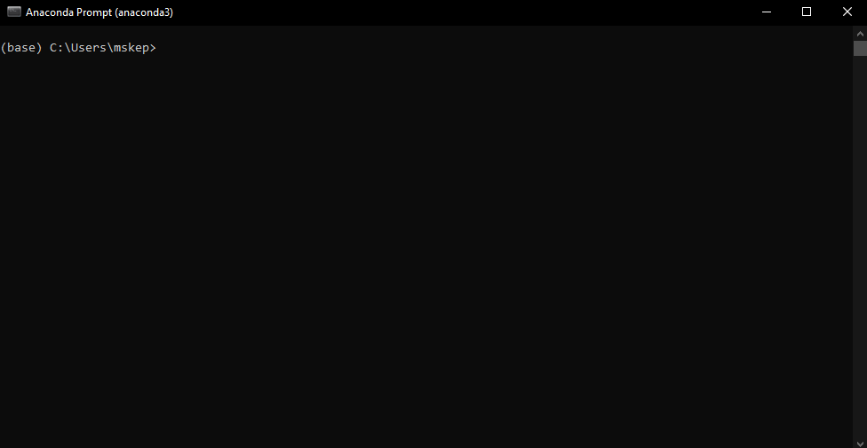
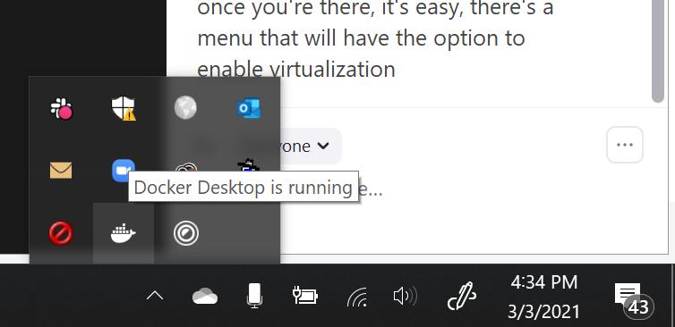
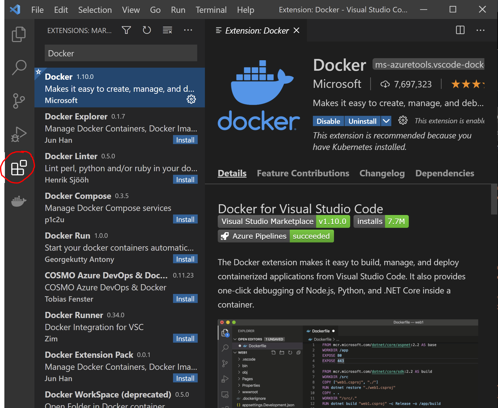
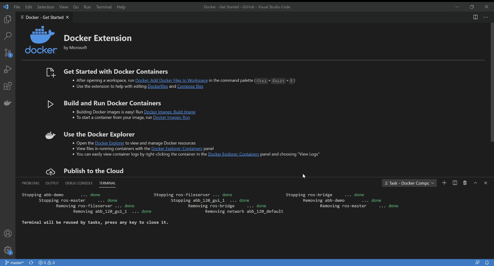
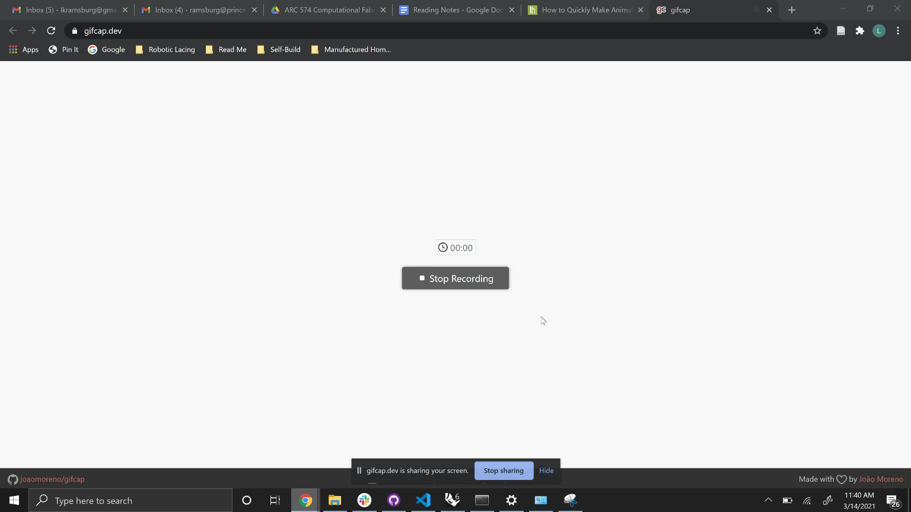
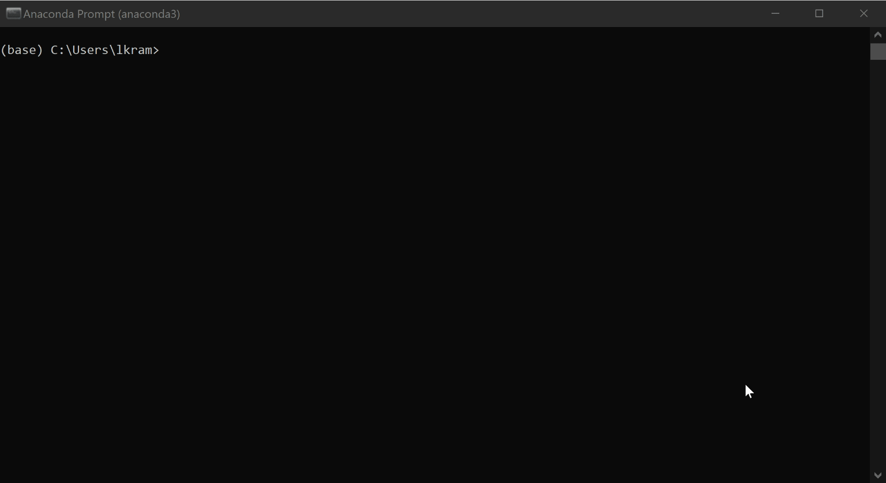
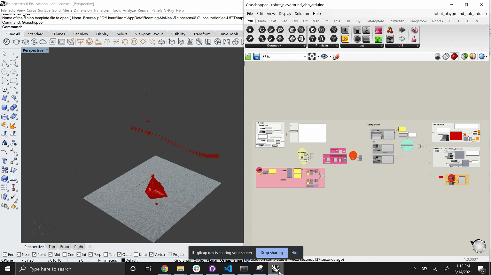
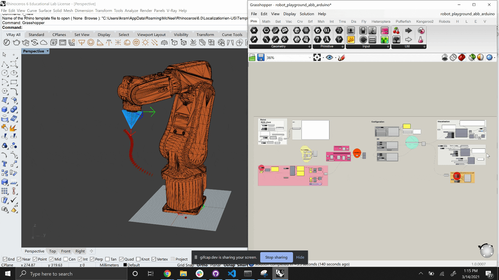

# Documentation
# **Part 1: Download Anaconda:**

_In this part you will download anaconda a python distribution. By downloading anaconda you receive everything you need to run python. If you are wondering what python is, it is a programing language. Here is python.org&#39;s_ [_definition_](https://www.python.org/doc/essays/blurb/)_._

1) Go to page: [https://www.anaconda.com/products/individual](https://www.anaconda.com/products/individual)
    1) Hit Download to take you to the location of the installation files 
    2. Install appropriate version<br/>
Mac users: graphical installer<br/>
       Window users: download the appropriate version  
      (If unsure of which version go to _Start button > Settings > System > About_)<br/> <br/>
       &nbsp; &nbsp; <br/> 

2. Open the Anaconda3 installer using default settings 
    1. Install for: Just Me 
    2. Destination Folder: this can be wherever 
    3. Advance options: none 
    4. Last page you may want to uncheck both boxes unless you want those pages to open in your browser 

# **Part 2: Use Anaconda prompt to download compas &amp; compas\_fab:**

_In this part you will use the command prompt (terminal if on mac) to install compas and compas\_fab (frameworks that will help you visualize the robots in rhino using grasshopper and python). You can read more about COMPAS and COMPAS\_FAB here:_ [_Compas\_fab_](https://gramaziokohler.github.io/compas_fab/latest/overview.html)_,_ [_Compas_](https://compas.dev/compas/index.html)_. For this installation we will be using a command prompt specific to anaconda (the program we installed in the previous step). It may look intimidating at first. However, once you understand how to use the command prompt/terminal, it can be a very useful tool. If you want to read more about why developers use the command prompt/terminal check_ _[this article](https://www.digitalcitizen.life/what-is-cmd)._

1. Open the anaconda prompt as an administrator
    1. Windows: type anaconda prompt in the windows search bar <br/>
     &nbsp; &nbsp; &nbsp; &nbsp; <br/>
    2. Mac: Open Launchpad, then click the terminal icon. <br/>
     &nbsp; &nbsp; &nbsp; &nbsp; <br/>
2. Now we will use the prompt to install compas and compas\_fab. In the anaconda prompt/terminal type in each of these lines found below (hitting enter after each line). You can optionally copy and paste **all** of the lines. Either use (_crtl v / cmd v_) depending on your computer. If that does not work try right clicking. However before you do that you may want to change the name of the python environment. In this cause it is simply your_env_name but you could change this to be anything. **Just make sure you have the same environment name for every step**

```console
conda config --add channels conda-forge
conda remove --name your_env_name --all
conda create -n your_env_name python=3.6 compas compas_fab --yes
conda activate your_env_name
python -m compas_rhino.install
```
For the last two steps you will need to allow the anaconda prompt/terminal to make changes to local rhino files. So make sure you are logged in as an administrator.


_Explained below is what each line is does:_

```console 
(base) conda config --add channels conda-forge 
```
Adds the package conda-forge: _[https://conda-forge.org/#about](https://conda-forge.org/#about)_ <br/> <br/> 
```console 
(base) conda remove --name your_env_name --all 
``` 
Removes any environment with that name in preparation to create new one with updated version of python compas and compas_fab <br/>  <br/>
 ```console 
 (base) conda create -n your_env_name python=3.6 compas compas_fab --yes 
 ``` 
Creates a new python environment and installs compas and compas_fab. Python environments are helpful because they store everything you need for a certain project. In this case, in our project our dependencies are compas and compas_fab so we include them in our environment. If we were to start another project we could then create a new environment that includes everything we need for that project.<br/>  <br/>
 ```console 
 (base) conda activate your_env_name
 ``` 
Activates the environment created in the previous step  <br/><br/> 
   ```console 
   (your_env_name) python -m compas_rhino.install 
   ```
Installs compas and compas_fab for rhino <br/><br/> 
* * *
3. Finally check to make sure that the installation worked by typing/copying and pasting the following code: <br/>

```console
python
import compas_fab
compas_fab.__version__
```
You should see:
```console
'0.16.0';
```


_In this step we are starting a python file, adding the package compas\_fab (which we installed in the previous step) and requesting the package&#39;s version. You should have installed the most current package. So a version of 0.16.0 or newer should be printed on the screen._ <br/><br/> 

    
# **Part 3: Downloading github &amp; files needed to run robots from grasshopper**

_In this part you will download github desktop. You will use this to get a repository from the web that will help you work with the robots in grasshopper. We are using github desktop to retrieve these files because we want to clone them instead of downloading them. Cloning is similar to downloading but has the option to update the files if they are changed by the creator._ 

1) Download &amp; setup GitHub for desktop: [https://desktop.github.com](https://desktop.github.com/) 
    1) The proper type of GitHub should appear (i.e. mac, windows x64, etc.) however if it does not just download the appropriate version for your computer.
    2) Click installer for Windows and double click the downloaded zip folder for Mac to install.
    3) Open GitHub desktop.
    4) If you have an account sign in. If not it is recommended that you make one.
 
2) Go to documents and find the GitHub folder
    1) This is where the repositories at default will be saved
    2) If you want you can create a subfolder for the repositories from this class (see part 3. v.). Make sure to not have spaces in the name of the subfolder and try to stay away from special characters as well. These specific characters can cause issues when referencing the paths (as we see in iv.)

    
# **Part 4: ABB Communication**
_The ABB communication library is a collection of [python](https://www.python.org/doc/essays/blurb/) functions that makes communication between the ABB robot controller and your computer possible. While ABB provides its own software (RobotStudio) that allows you connect to the robot controller, change settings, send instructions, and also receive feedback, a python-based means of communication is much a easier to learn and implement in design projects, especially because we can execute python code directly from Rhino and Grasshopper._

While Compas and CompasFab are available to download and install using only conda commands, the ABB communication library must be cloned from GitHub and then installed in a similar way. 

You can clone the repository using a desktop application such as the [Github app](https://desktop.github.com/). To keep things simple, however, we are just going to close the repository using the command line.  

1) Make a folder in Documents called GitHub
2) Open Anaconda Prompt
3) Use Anaconda Prompt to activate your environment (from Part 2)

If you don't remember what you named your environment in Part 2, type into Anaconda Prompt:
```
conda env list
```

Once you know the name of your environment, activate it.
```
activate your_env_name
```
4) Navigate to the GitHub folder that you created in Documents.  Copy the path.  
5) Clone the repository

```
cd (insert here the path you just copied in step 4)
git clone https://github.com/createchaos/abb_communication.git
```
6) A folder was just created in Documents > GitHub called abb_communication.  Copy the path for the abb_communication folder. Run the following commands by copying them one at a time into Anaconda Prompt.  Press enter after each line.

```
cd (insert here the path you just copied in step 6)
pip install -e .
python -m compas_rhino.install -p abb_communication
```
Tip: don't forget the dot at the end of the `pip install -e .` command! 

# **Part 5: Install Docker**
_We will use Docker to set up backends that will enable us to visualize the robots in Grasshopper. Docker containers are like pre-packaged bubbles of code that we can access to avoid building the robot communication setup from scratch._

more info on docker here: https://gramaziokohler.github.io/compas_fab/latest/backends.html 

1) Docker reqires Windows 10 Pro, Enterprise, or Education.    
    1) To check what software you have on your computer, type "System Information" in the Search Box. 
    2) If you do not already have Windows 10 Pro, Enterprise, or Education, you can get a license here: https://princeton.onthehub.com/
    3) Click "start shopping", enter your Princeton login information, and download Windows 10 Education.
    4) Note: If you have trouble switching the license key, try restarting your computer. 

2) Download Docker
    Docker for Windows: https://hub.docker.com/editions/community/docker-ce-desktop-windows
    Docker for Mac: https://hub.docker.com/editions/community/docker-ce-desktop-mac 
    
3) Check to see if Docker is running by looking for the whale


4) If you get an error about needing to enable Virtualization in BIOS, follow the instructions here: https://bce.berkeley.edu/enabling-virtualization-in-your-pc-bios.html
Note: The instructions will vary depending on the type of computer you have

# **Part 6: Install Visual Studio Code**
_Visual Studio Code allows us to visualize the Docker containers that are running on our machines._ 

1) Download Visual Studio code 
    https://code.visualstudio.com/
    
2) Install the Docker Extension for Visual Studio Code 
    1) Navigate to the extensions tab (4th icon on the left bar with four boxes) 
    2) Search for Docker 
    3) Install Docker extension




# **Part 7: ABB Setup**
_The following steps will get you setup to use the small ABB robot arms at the ECL_

1) Turn on the robots 


2) Use Visual Studio Code to get Docker running


3) Connect the robots to your computer.  You will probably need to use an ethernet - USB adapter 


4) Change the settings for the ethernet cable you just connected. Note: the IP adress you input has to start with 192.168.0 but the fourth number can be anything other than 102 and 103 (these are the IP addresses of the robots).  15 is a nice number, but feel free to pick your favorite. 


5) Open Rhino and Grasshopper.  Open the robot_playground_abb_arduino.ghx.  Note: If you are going to make changes to the file, please save it locally (not in the ARC 574 repository folder on your computer) 

6) use Anaconda Prompt to active your environment.  Then ping the robots to check if you are connected. The small ABBs are 192.168.0.102 and 192.168.0.103 
    Note: if you receive a message that says "request timed out", go back and make sure you have completed steps 1-5 correctly.


7) In the Grasshopper file, connect to ROS and load the robot for visualization 


8) On the robot controller, go to the Production Window.  Tap the "PP to main" button on the screen.  Press the live switch on the controller (hold half way and keep holding forever).  Press play.  On the screen you will see "waiting for connection" 

9) In the Grasshopper file, init, robot on, update settings.  After hitting the robot on button, you should see "connected" on the robot controller.  


10) Now you are ready to send planes! 


